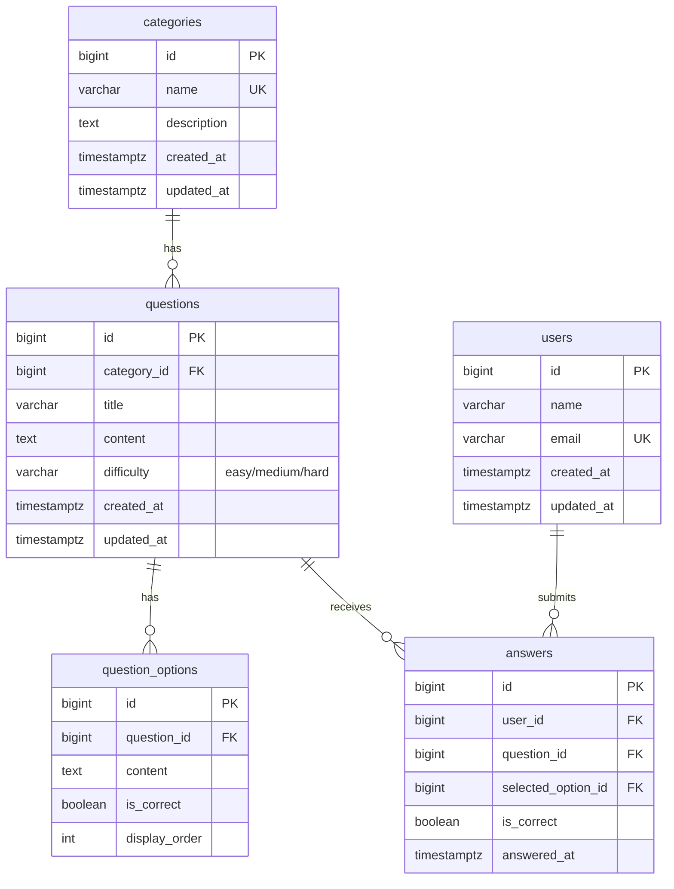

# データモデル / ERD（demo）

**目的**: 実装/レビュー/運用が同じ参照を見られるように、ドメイン境界とテーブル関係を Mermaid で固定する。
**作成/更新タイミング**: `/design` の前半（MVPの主要エンティティが見えたら）。

---

## ER 図

---

## テーブル間の関係性

### 外部キー制約一覧

| FK 制約名 | 参照元テーブル | 参照元カラム | 参照先テーブル | 参照先カラム | ON DELETE | ON UPDATE | 説明 |
| -------- | -------------- | ------------ | -------------- | ------------ | -------- | -------- | ---- |
| fk_questions_category | questions | category_id | categories | id | RESTRICT | CASCADE | カテゴリ削除を制限 |
| fk_question_options_question | question_options | question_id | questions | id | CASCADE | CASCADE | 問題削除時に選択肢も削除 |
| fk_answers_user | answers | user_id | users | id | CASCADE | CASCADE | ユーザー削除時に回答も削除 |
| fk_answers_question | answers | question_id | questions | id | CASCADE | CASCADE | 問題削除時に回答も削除 |
| fk_answers_option | answers | selected_option_id | question_options | id | SET NULL | CASCADE | 選択肢削除時はNULL |

### テーブル間の依存関係

- **categories → questions**: 1対多。カテゴリに問題が紐づいている場合、カテゴリ削除不可（要件5.6）
- **questions → question_options**: 1対多。問題削除時は選択肢もカスケード削除
- **users → answers**: 1対多。ユーザー削除時は回答履歴もカスケード削除
- **questions → answers**: 1対多。問題削除時は回答履歴もカスケード削除

### データ整合性ルール

1. **categories**: 問題が存在する限り削除不可（RESTRICT）
2. **questions**: カテゴリ必須、難易度は enum 制約
3. **users**: email はユニーク制約
4. **difficulty**: 'easy', 'medium', 'hard' のいずれか

---

## 参照
- **テーブル定義書**: `table-definition.md`
- **機能一覧**: `feature-list.md`

---

## 変更履歴

| 日付 | バージョン | 変更者 | 変更内容 |
| ---- | ---------- | ------ | -------- |
| 2024-12-23 | v1.0 | - | 初版作成 |
