# データモデル / ERD（cursor-sdd-demo）

**目的**: 実装/レビュー/運用が同じ参照を見られるように、ドメイン境界とテーブル関係を Mermaid で固定する。
**作成/更新タイミング**: `/design` の前半（MVPの主要エンティティが見えたら）。詳細は `.cursor/templates/artifacts/artifacts_rules.md`。

---

## 1. ER 図

**記載ルール（必須）**
- `erDiagram` 内で、関係線だけでなく **各テーブルのカラム定義ブロック**（PK/UK/FK）も記載する。
- PK/UK/FK は分かる範囲で明示する（最低限 `id PK`、主要UK、参照カラムの `FK`）。
- `%%` は Mermaid のコメントとして使用してよい。

```mermaid
erDiagram
  %% === マスタテーブル ===
  
  m_product {
    bigint id PK
    varchar sku_code UK "SKUコード"
    varchar name "商品名"
    varchar unit "単位(pcs/box等)"
    varchar category "カテゴリ"
    integer safety_stock "安全在庫数"
    boolean is_active "有効フラグ"
    timestamptz created_at
    timestamptz updated_at
  }

  m_location {
    bigint id PK
    varchar location_code UK "ロケーションコード"
    varchar warehouse "倉庫"
    varchar area "エリア"
    varchar shelf "棚番"
    boolean is_active "有効フラグ"
    timestamptz created_at
    timestamptz updated_at
  }

  %% === 在庫残テーブル ===

  t_stock_balance {
    bigint id PK
    bigint product_id FK
    bigint location_id FK
    integer quantity "在庫数量"
    timestamptz created_at
    timestamptz updated_at
  }

  %% === 入庫テーブル ===

  t_receipt {
    bigint id PK
    varchar receipt_no UK "入庫番号"
    varchar status "draft/confirmed"
    timestamptz receipt_date "入庫日"
    text remarks "備考"
    timestamptz created_at
    timestamptz updated_at
    timestamptz confirmed_at "確定日時"
  }

  t_receipt_detail {
    bigint id PK
    bigint receipt_id FK
    bigint product_id FK
    bigint location_id FK
    integer quantity "数量"
    timestamptz created_at
    timestamptz updated_at
  }

  %% === 出庫テーブル ===

  t_shipment {
    bigint id PK
    varchar shipment_no UK "出庫番号"
    varchar status "draft/confirmed"
    timestamptz shipment_date "出庫日"
    text remarks "備考"
    timestamptz created_at
    timestamptz updated_at
    timestamptz confirmed_at "確定日時"
  }

  t_shipment_detail {
    bigint id PK
    bigint shipment_id FK
    bigint product_id FK
    bigint location_id FK
    integer quantity "数量"
    timestamptz created_at
    timestamptz updated_at
  }

  %% === 取引履歴テーブル ===

  t_transaction_history {
    bigint id PK
    bigint product_id FK
    bigint location_id FK
    varchar transaction_type "receipt/shipment/adjustment"
    integer quantity "数量(+/-)"
    bigint reference_id "参照伝票ID"
    varchar reference_type "receipt/shipment/inventory"
    text remarks "備考"
    timestamptz transaction_date "取引日時"
    timestamptz created_at
  }

  %% === 棚卸しテーブル ===

  t_inventory {
    bigint id PK
    varchar inventory_no UK "棚卸番号"
    varchar status "in_progress/confirmed"
    timestamptz inventory_date "棚卸日"
    text remarks "備考"
    timestamptz created_at
    timestamptz updated_at
    timestamptz confirmed_at "確定日時"
  }

  t_inventory_count {
    bigint id PK
    bigint inventory_id FK
    bigint product_id FK
    bigint location_id FK
    integer book_quantity "帳簿在庫"
    integer actual_quantity "実在庫"
    integer difference "差異"
    text difference_reason "差異理由"
    timestamptz created_at
    timestamptz updated_at
  }

  %% === リレーション ===

  m_product ||--o{ t_stock_balance : "has"
  m_location ||--o{ t_stock_balance : "has"
  
  t_receipt ||--|{ t_receipt_detail : "contains"
  m_product ||--o{ t_receipt_detail : "references"
  m_location ||--o{ t_receipt_detail : "references"
  
  t_shipment ||--|{ t_shipment_detail : "contains"
  m_product ||--o{ t_shipment_detail : "references"
  m_location ||--o{ t_shipment_detail : "references"
  
  m_product ||--o{ t_transaction_history : "has"
  m_location ||--o{ t_transaction_history : "has"
  
  t_inventory ||--|{ t_inventory_count : "contains"
  m_product ||--o{ t_inventory_count : "references"
  m_location ||--o{ t_inventory_count : "references"
```

---

## 2. テーブル間の関係性

### 2.1 外部キー制約一覧

| FK 制約名 | 参照元テーブル | 参照元カラム | 参照先テーブル | 参照先カラム | ON DELETE | ON UPDATE | 説明 |
| -------- | -------------- | ------------ | -------------- | ------------ | -------- | -------- | ---- |
| fk_stock_balance_product | t_stock_balance | product_id | m_product | id | RESTRICT | CASCADE | 在庫残→商品 |
| fk_stock_balance_location | t_stock_balance | location_id | m_location | id | RESTRICT | CASCADE | 在庫残→ロケーション |
| fk_receipt_detail_receipt | t_receipt_detail | receipt_id | t_receipt | id | CASCADE | CASCADE | 入庫明細→入庫 |
| fk_receipt_detail_product | t_receipt_detail | product_id | m_product | id | RESTRICT | CASCADE | 入庫明細→商品 |
| fk_receipt_detail_location | t_receipt_detail | location_id | m_location | id | RESTRICT | CASCADE | 入庫明細→ロケーション |
| fk_shipment_detail_shipment | t_shipment_detail | shipment_id | t_shipment | id | CASCADE | CASCADE | 出庫明細→出庫 |
| fk_shipment_detail_product | t_shipment_detail | product_id | m_product | id | RESTRICT | CASCADE | 出庫明細→商品 |
| fk_shipment_detail_location | t_shipment_detail | location_id | m_location | id | RESTRICT | CASCADE | 出庫明細→ロケーション |
| fk_transaction_history_product | t_transaction_history | product_id | m_product | id | RESTRICT | CASCADE | 取引履歴→商品 |
| fk_transaction_history_location | t_transaction_history | location_id | m_location | id | RESTRICT | CASCADE | 取引履歴→ロケーション |
| fk_inventory_count_inventory | t_inventory_count | inventory_id | t_inventory | id | CASCADE | CASCADE | 棚卸明細→棚卸 |
| fk_inventory_count_product | t_inventory_count | product_id | m_product | id | RESTRICT | CASCADE | 棚卸明細→商品 |
| fk_inventory_count_location | t_inventory_count | location_id | m_location | id | RESTRICT | CASCADE | 棚卸明細→ロケーション |

### 2.2 テーブル間の依存関係

- **m_product → t_stock_balance**: 1対多。商品が削除されると在庫残が孤立するためRESTRICT
- **m_location → t_stock_balance**: 1対多。ロケーションが削除されると在庫残が孤立するためRESTRICT
- **t_receipt → t_receipt_detail**: 1対多。伝票削除時は明細もCASCADE削除
- **t_shipment → t_shipment_detail**: 1対多。伝票削除時は明細もCASCADE削除
- **t_inventory → t_inventory_count**: 1対多。棚卸削除時は明細もCASCADE削除

### 2.3 データ整合性ルール

1. **Source of Truth**: `t_stock_balance` が在庫残の正。入出庫確定時に更新。
2. **追記のみ**: `t_transaction_history` は追記のみ（UPDATE/DELETE禁止）
3. **一意制約**: `t_stock_balance` は (product_id, location_id) でUNIQUE
4. **論理削除**: マスタテーブル（m_product, m_location）は `is_active` フラグで論理削除
5. **参照整合性**: マスタ参照はRESTRICT（削除不可）、伝票明細はCASCADE

---

## 3. 参照
- **テーブル定義書**: `table-definition.md`
- **機能一覧**: `feature-list.md`

---

## 変更履歴

| 日付 | バージョン | 変更者 | 変更内容 |
| ---- | ---------- | ------ | -------- |
| 2025-12-14 | v1.0 | | 初版作成 |
