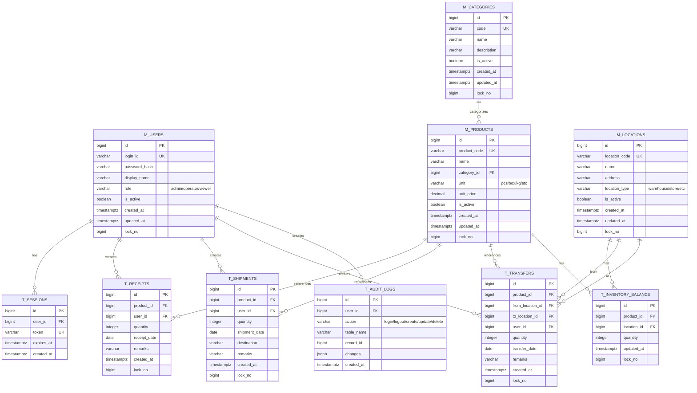

# データモデル / ERD（cursor-sdd-demo）

**目的**: 実装/レビュー/運用が同じ参照を見られるように、ドメイン境界とテーブル関係を Mermaid で固定する。
**作成/更新タイミング**: `/design` の前半（MVPの主要エンティティが見えたら）。詳細は `.cursor/templates/artifacts/artifacts_rules.md`。

---

## 1. ER 図

**記載ルール（必須）**
- `erDiagram` 内で、関係線だけでなく **各テーブルのカラム定義ブロック**（PK/UK/FK）も記載する。
- PK/UK/FK は分かる範囲で明示する（最低限 `id PK`、主要UK、参照カラムの `FK`）。
- `%%` は Mermaid のコメントとして使用してよい。

---

## 2. テーブル間の関係性

### 2.1 外部キー制約一覧

| FK 制約名 | 参照元テーブル | 参照元カラム | 参照先テーブル | 参照先カラム | ON DELETE | ON UPDATE | 説明 |
| -------- | -------------- | ------------ | -------------- | ------------ | -------- | -------- | ---- |
| fk_sessions_user | t_sessions | user_id | m_users | id | CASCADE | CASCADE | ユーザー削除時にセッションも削除 |
| fk_products_category | m_products | category_id | m_categories | id | RESTRICT | CASCADE | カテゴリに商品がある場合は削除不可 |
| fk_receipts_product | t_receipts | product_id | m_products | id | RESTRICT | CASCADE | 商品削除時に入庫履歴は保持 |
| fk_receipts_user | t_receipts | user_id | m_users | id | RESTRICT | CASCADE | ユーザー削除時に入庫履歴は保持 |
| fk_shipments_product | t_shipments | product_id | m_products | id | RESTRICT | CASCADE | 商品削除時に出庫履歴は保持 |
| fk_shipments_user | t_shipments | user_id | m_users | id | RESTRICT | CASCADE | ユーザー削除時に出庫履歴は保持 |
| fk_transfers_product | t_transfers | product_id | m_products | id | RESTRICT | CASCADE | 商品削除時に移動履歴は保持 |
| fk_transfers_from_location | t_transfers | from_location_id | m_locations | id | RESTRICT | CASCADE | 移動元ロケーション削除時に移動履歴は保持 |
| fk_transfers_to_location | t_transfers | to_location_id | m_locations | id | RESTRICT | CASCADE | 移動先ロケーション削除時に移動履歴は保持 |
| fk_transfers_user | t_transfers | user_id | m_users | id | RESTRICT | CASCADE | ユーザー削除時に移動履歴は保持 |
| fk_inventory_product | t_inventory_balance | product_id | m_products | id | CASCADE | CASCADE | 商品削除時に在庫残高も削除 |
| fk_inventory_location | t_inventory_balance | location_id | m_locations | id | CASCADE | CASCADE | ロケーション削除時に在庫残高も削除 |
| fk_audit_user | t_audit_logs | user_id | m_users | id | SET NULL | CASCADE | ユーザー削除時にログは保持（user_idはNULL） |

### 2.2 テーブル間の依存関係

- **依存関係の要約**:
  - `m_users → t_sessions`: 1対多。ユーザーが無効化されても既存セッションは有効期限まで保持
  - `m_categories → m_products`: 1対多。カテゴリに商品が紐づいている場合は削除不可
  - `m_products → t_receipts/t_shipments/t_transfers`: 1対多。商品の入出庫・移動履歴は監査証跡として保持
  - `m_products → t_inventory_balance`: 1対多（ロケーション別）。商品ごと・ロケーションごとの在庫残高を管理
  - `m_locations → t_inventory_balance`: 1対多。ロケーションごとの在庫を管理
  - `m_users → t_audit_logs`: 1対多。すべての操作ログをユーザーIDとともに記録

### 2.3 データ整合性ルール

- **整合性方針**:
  1. **正（source of truth）**: 
     - 在庫残高の正は`t_inventory_balance`テーブル
     - 入出庫履歴は`t_receipts`, `t_shipments`, `t_transfers`で監査証跡として保持
  2. **更新禁止/追記のみ（監査性）**: 
     - トランザクションテーブル（t_receipts, t_shipments, t_transfers）は追記のみ（UPDATE/DELETE不可）
     - 修正が必要な場合は逆仕訳を追加
  3. **冪等性**: 
     - 各トランザクションにはidが一意に割り当てられ、重複登録を防止
  4. **論理削除/無効化方針**: 
     - マスタテーブル（m_users, m_products, m_categories, m_locations）は`is_active`フラグで論理削除
     - トランザクションテーブルは物理削除しない
  5. **参照整合性（ON DELETE 方針）**: 
     - セッションはユーザー削除時にCASCADE削除
     - 履歴テーブルはRESTRICTで保護（削除前に無効化が必要）
     - 在庫残高は商品/ロケーション削除時にCASCADE削除
  6. **楽観的ロック**: 
     - すべてのマスタテーブルと在庫残高テーブルに`lock_no`カラムを配置
     - 更新時に`lock_no`をチェックし、競合を検出

---

## 3. 参照
- **テーブル定義書**: `table-definition.md`
- **機能一覧**: `feature-list.md`

---

## 変更履歴

| 日付 | バージョン | 変更者 | 変更内容 |
| ---- | ---------- | ------ | -------- |
| 2025-12-15 | v1.0 |  | 初版作成 |
