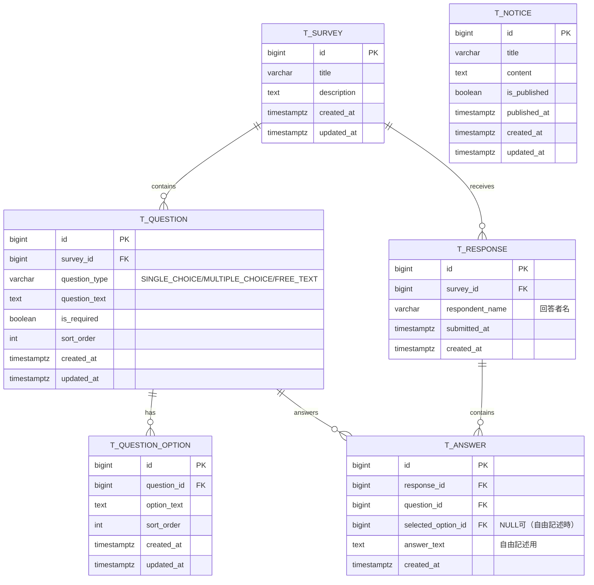

# データモデル / ERD（cursor-sdd-demo）

**目的**: 実装/レビュー/運用が同じ参照を見られるように、ドメイン境界とテーブル関係を Mermaid で固定する。

---

## ER 図

---

## テーブル間の関係性

### 外部キー制約一覧

| FK 制約名 | 参照元テーブル | 参照元カラム | 参照先テーブル | 参照先カラム | ON DELETE | ON UPDATE |
| -------- | -------------- | ------------ | -------------- | ------------ | -------- | -------- |
| fk_question_survey | t_question | survey_id | t_survey | id | CASCADE | CASCADE |
| fk_option_question | t_question_option | question_id | t_question | id | CASCADE | CASCADE |
| fk_response_survey | t_response | survey_id | t_survey | id | CASCADE | CASCADE |
| fk_answer_response | t_answer | response_id | t_response | id | CASCADE | CASCADE |
| fk_answer_question | t_answer | question_id | t_question | id | CASCADE | CASCADE |

### テーブル間の依存関係

- **t_survey → t_question**: 1対多。アンケート削除時は質問も削除
- **t_question → t_question_option**: 1対多。質問削除時は選択肢も削除
- **t_survey → t_response**: 1対多。アンケート削除時は回答も削除
- **t_response → t_answer**: 1対多。回答削除時は個別回答も削除
- **t_notice**: 独立エンティティ（他テーブルへの依存なし）

---

## 変更履歴

| 日付 | バージョン | 変更者 | 変更内容 |
| ---- | ---------- | ------ | -------- |
| 2024-12-21 | v1.0 | | 初版作成 |
| 2024-12-21 | v1.1 | | 認証除外、お知らせテーブル追加 |
