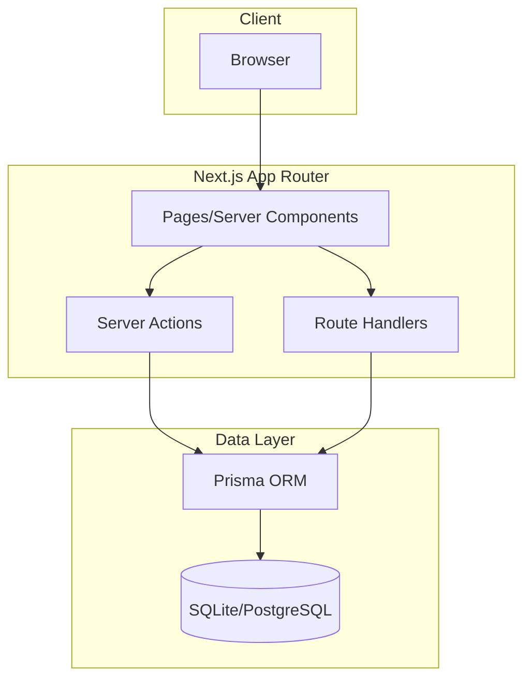
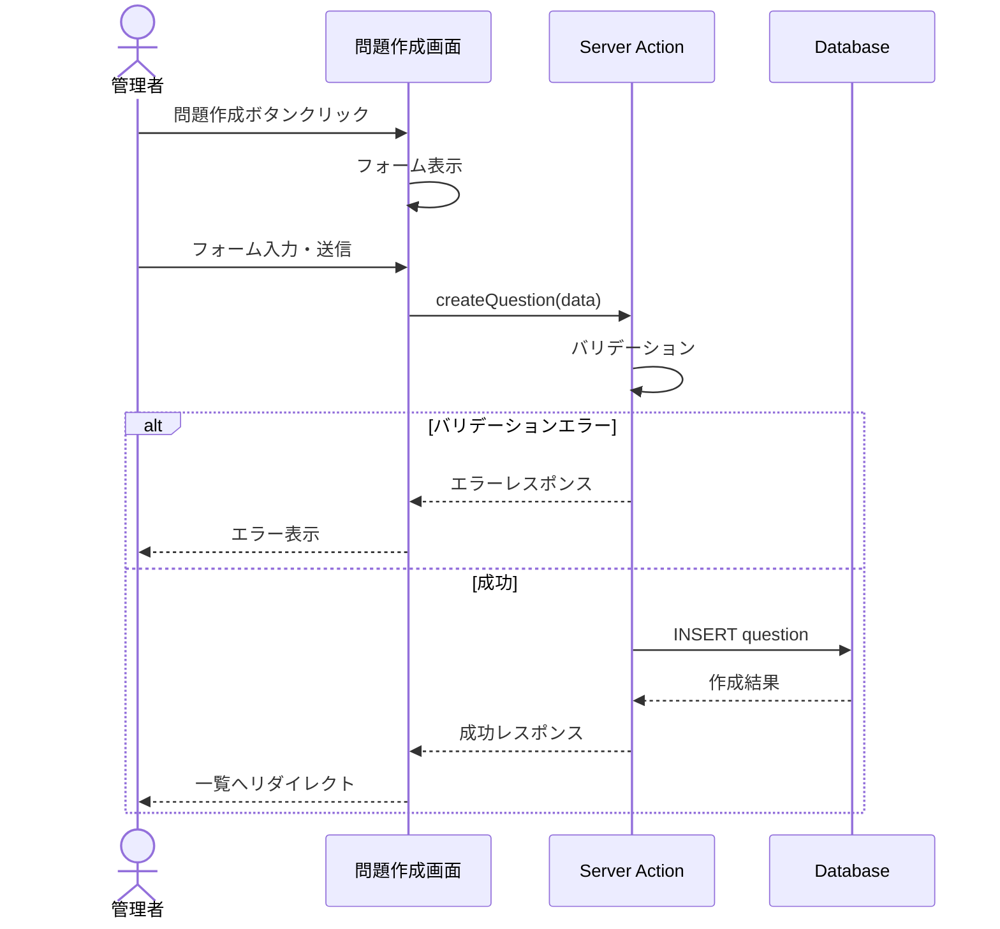
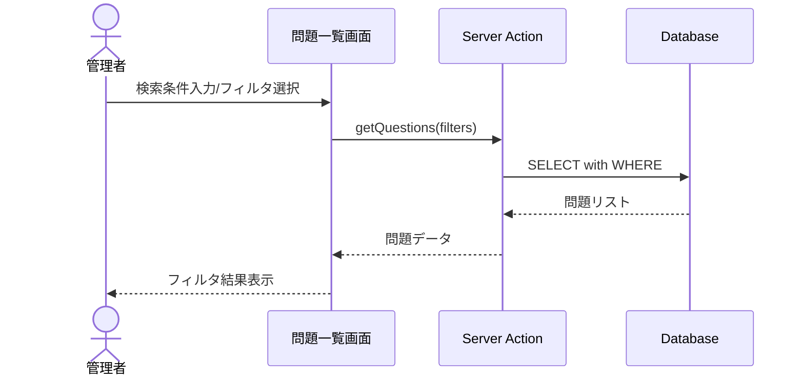
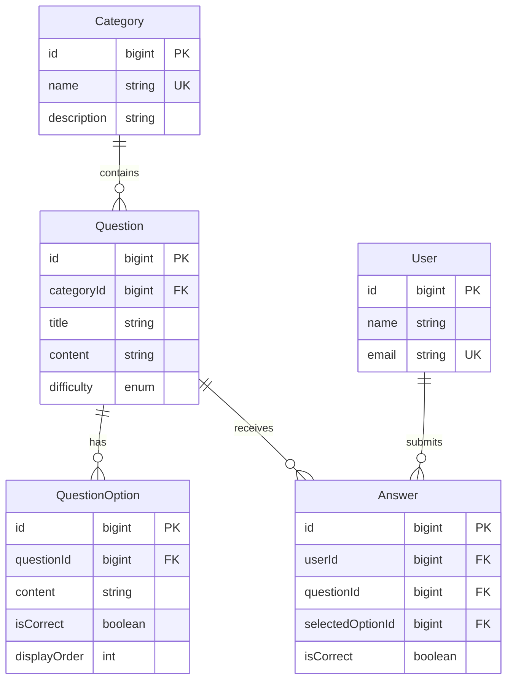

# 設計ドキュメント

---
**目的**: 実装者が異なる場合でも一貫した実装を保証するために、十分な詳細を提供し、解釈のズレを防ぐ。
---

## 概要

**目的**: 本システムは管理者に問題演習コンテンツの効率的な管理機能を提供する。問題の作成・編集・削除、カテゴリ・難易度による分類、学習者アカウントの管理を一元化することで、教育コンテンツの運用効率を向上させる。

**ユーザー**: 管理者が問題演習システムの管理画面でこれを利用する。

**成果物**:
> - `.cursor/cursor-sdd-demo/artifacts/feature-list.md`
> - `.cursor/cursor-sdd-demo/artifacts/data-model.md`
> - `.cursor/cursor-sdd-demo/artifacts/table-definition.md`

### ゴール
- 問題のCRUD操作を直感的に行える管理画面
- カテゴリ・難易度による問題の体系的な分類
- 学習者アカウントの効率的な管理
- キーワード検索・フィルタによる問題の素早い検索

### 非ゴール
- 学習者向けの問題解答画面（本スコープは管理画面のみ）
- 学習進捗の詳細分析・レポート機能
- 管理者認証・権限管理（将来拡張）
- 問題のインポート/エクスポート機能

## アーキテクチャ

> 詳細な調査ノートは`research.md`を参照。

### アーキテクチャパターン＆境界マップ

**アーキテクチャ統合**:
- 選択パターン: Server Components + Server Actions（Next.js App Router標準）
- ドメイン/機能境界: 問題管理・ユーザー管理・カテゴリ管理の3ドメインに分離
- 維持する既存パターン: App Router、Tailwind CSS、TypeScript strict mode
- 新コンポーネントの理由: CRUD画面とServer Actionsが必要

### 技術スタック

| レイヤー | 選択 / バージョン | 機能での役割 | 備考 |
|---------|-----------------|-------------|------|
| フロントエンド | Next.js 16.1.1, React 19.2.3 | UI描画、ルーティング | 既存 |
| スタイリング | Tailwind CSS 4 | UIスタイリング | 既存 |
| バックエンド | Next.js Server Actions | データ操作API | 既存機能活用 |
| ORM | Prisma (追加推奨) | 型安全なDB操作 | 新規追加 |
| データベース | SQLite (開発) / PostgreSQL (本番) | データ永続化 | 新規追加 |
| リンター | Biome 2.2.0 | コード品質 | 既存 |

## システムフロー

### 問題作成フロー

### 問題検索・フィルタフロー

## 要件トレーサビリティ

| 要件 | 概要 | コンポーネント | インターフェース | フロー |
|------|------|--------------|----------------|--------|
| 1.1-1.9 | 問題管理CRUD | QuestionForm, QuestionList | questionActions | 問題作成フロー |
| 2.1-2.8 | ユーザー管理CRUD | UserForm, UserList | userActions | - |
| 3.1-3.3 | 問題一覧表示 | QuestionList | getQuestions | - |
| 4.1-4.3 | ユーザー一覧表示 | UserList | getUsers | - |
| 5.1-5.6 | カテゴリ管理 | CategoryForm, CategoryList | categoryActions | - |
| 6.1-6.5 | 問題検索・フィルタ | QuestionFilter | getQuestions | 検索フィルタフロー |

## コンポーネントとインターフェース

| コンポーネント | ドメイン/レイヤー | 意図 | 要件カバレッジ | 主要な依存関係 | 契約 |
|--------------|-----------------|------|--------------|---------------|------|
| QuestionList | UI/問題管理 | 問題一覧表示・検索・フィルタ | 1.3, 3.1-3.3, 6.1-6.5 | getQuestions (P0) | State |
| QuestionForm | UI/問題管理 | 問題作成・編集フォーム | 1.1-1.2, 1.4, 1.7-1.9 | categoryActions (P1) | State |
| UserList | UI/ユーザー管理 | ユーザー一覧表示 | 2.3, 4.1-4.3 | getUsers (P0) | State |
| UserForm | UI/ユーザー管理 | ユーザー登録・編集フォーム | 2.1-2.2, 2.4, 2.7-2.8 | - | State |
| CategoryList | UI/カテゴリ管理 | カテゴリ一覧表示・管理 | 5.1-5.6 | categoryActions (P0) | State |
| questionActions | Server/問題管理 | 問題CRUDロジック | 1.1-1.9 | Prisma (P0) | Service |
| userActions | Server/ユーザー管理 | ユーザーCRUDロジック | 2.1-2.8 | Prisma (P0) | Service |
| categoryActions | Server/カテゴリ管理 | カテゴリCRUDロジック | 5.1-5.6 | Prisma (P0) | Service |

### Server / 問題管理

#### questionActions

| フィールド | 詳細 |
|----------|------|
| 意図 | 問題のCRUD操作を提供 |
| 要件 | 1.1-1.9, 3.1-3.3, 6.1-6.5 |

**責任と制約**
- 問題の作成・取得・更新・削除
- カテゴリ・難易度によるフィルタリング
- キーワード検索（タイトル・本文）

**依存関係**
- アウトバウンド: Prisma Client — DB操作 (P0)

**契約**:
- `getQuestions`: フィルタ条件（キーワード、カテゴリ、難易度）でページネーション付き一覧取得
- `getQuestion`: ID指定で問題詳細取得
- `createQuestion`: 問題作成（タイトル・本文・カテゴリ・難易度必須）
- `updateQuestion`: 問題更新
- `deleteQuestion`: 問題削除

**不変条件**:
- カテゴリIDは存在するカテゴリを参照
- 難易度は easy / medium / hard のいずれか

---

### Server / ユーザー管理

#### userActions

| フィールド | 詳細 |
|----------|------|
| 意図 | ユーザー（学習者）のCRUD操作を提供 |
| 要件 | 2.1-2.8, 4.1-4.3 |

**責任と制約**
- ユーザーの登録・取得・更新・削除
- メールアドレスの重複チェック

**依存関係**
- アウトバウンド: Prisma Client — DB操作 (P0)

**契約**:
- `getUsers`: フィルタ条件でページネーション付き一覧取得
- `getUser`: ID指定でユーザー詳細取得
- `createUser`: ユーザー登録（名前・メールアドレス必須）
- `updateUser`: ユーザー更新
- `deleteUser`: ユーザー削除

**不変条件**:
- メールアドレスはユニーク（重複時はエラー）

---

### Server / カテゴリ管理

#### categoryActions

| フィールド | 詳細 |
|----------|------|
| 意図 | カテゴリのCRUD操作を提供 |
| 要件 | 5.1-5.6 |

**責任と制約**
- カテゴリの作成・取得・更新・削除
- 問題が紐づくカテゴリの削除を禁止

**依存関係**
- アウトバウンド: Prisma Client — DB操作 (P0)

**契約**:
- `getCategories`: カテゴリ一覧取得
- `getCategory`: ID指定でカテゴリ詳細取得
- `createCategory`: カテゴリ作成（名前必須、説明任意）
- `updateCategory`: カテゴリ更新
- `deleteCategory`: カテゴリ削除

**不変条件**:
- カテゴリ名はユニーク
- 問題が存在するカテゴリは削除不可（要件5.6）

---

### UI / 問題管理

#### QuestionList

| フィールド | 詳細 |
|----------|------|
| 意図 | 問題一覧の表示・検索・フィルタ・ページネーション |
| 要件 | 1.3, 3.1-3.3, 6.1-6.5 |

**実装ノート**
- Server Componentとして実装
- 検索・フィルタはURL検索パラメータで状態管理
- ページネーションはサーバーサイドで処理

#### QuestionForm

| フィールド | 詳細 |
|----------|------|
| 意図 | 問題の作成・編集フォーム |
| 要件 | 1.1-1.2, 1.4, 1.7-1.9 |

**実装ノート**
- Client Component（`'use client'`）
- カテゴリ・難易度はセレクトボックス
- バリデーションエラーはフィールド単位で表示

---

### UI / ユーザー管理

#### UserList

| フィールド | 詳細 |
|----------|------|
| 意図 | ユーザー一覧の表示・ページネーション |
| 要件 | 2.3, 4.1-4.3 |

#### UserForm

| フィールド | 詳細 |
|----------|------|
| 意図 | ユーザーの登録・編集フォーム |
| 要件 | 2.1-2.2, 2.4, 2.7-2.8 |

**実装ノート**
- メールアドレス重複エラーはサーバーサイドで検証

---

### UI / カテゴリ管理

#### CategoryList

| フィールド | 詳細 |
|----------|------|
| 意図 | カテゴリ一覧の表示・インライン編集・削除 |
| 要件 | 5.1-5.6 |

**実装ノート**
- 削除時は確認ダイアログを表示
- 問題が紐づくカテゴリは削除ボタン無効化またはエラー表示

## データモデル

> 詳細は `data-model.md` / `table-definition.md` を参照。

### ドメインモデル

### ビジネスルール & 不変条件
- カテゴリ名はユニーク
- ユーザーのメールアドレスはユニーク
- 難易度は 'easy' | 'medium' | 'hard' のいずれか
- 問題が存在するカテゴリは削除不可

## エラーハンドリング

### エラー戦略
- バリデーションエラー: フィールド単位でエラーメッセージを返却
- DB制約違反: ユーザーフレンドリーなメッセージに変換
- 予期せぬエラー: エラーログ出力 + 汎用エラーメッセージ表示

### エラーカテゴリとレスポンス
- **ユーザーエラー (4xx)**: バリデーションエラー → フィールドレベル検証
- **ビジネスロジックエラー (422)**: カテゴリ削除不可 → 条件説明
- **システムエラー (5xx)**: DB接続エラー → 汎用エラーメッセージ

## テスト戦略

### ユニットテスト
- questionActions: 作成・更新・削除・検索ロジック
- userActions: 作成・更新・削除・重複チェック
- categoryActions: 作成・更新・削除制約チェック

### 統合テスト
- 問題作成→一覧表示フロー
- カテゴリ削除制約の検証
- ユーザーメールアドレス重複検証

### E2E/UIテスト
- 問題CRUD操作フロー
- 検索・フィルタ機能
- ユーザー登録・編集フロー

---

## 変更履歴

| 日付 | バージョン | 変更者 | 変更内容 |
| ---- | ---------- | ------ | -------- |
| 2024-12-23 | v1.0 | - | 初版作成 |
