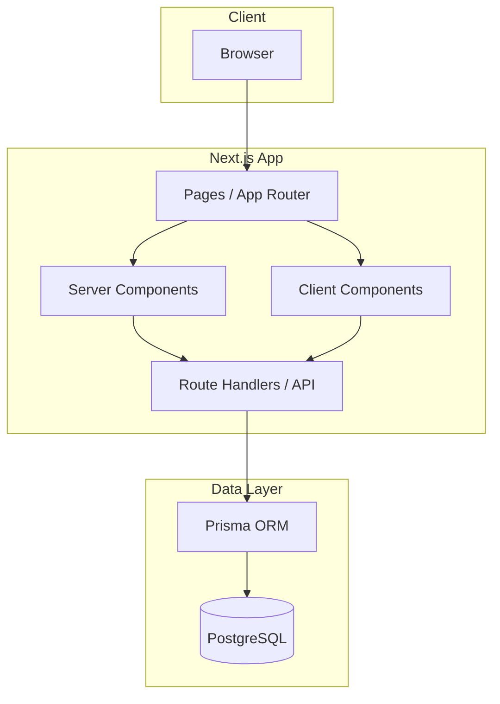
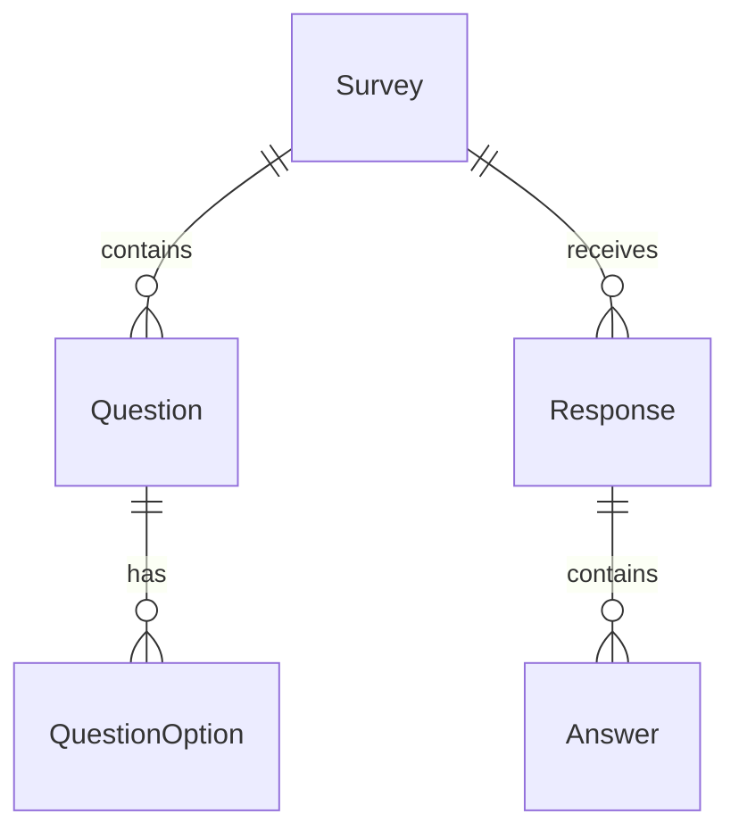

# 設計ドキュメント

## 概要

**目的**: アンケートアプリの管理画面は、管理者がアンケートの作成・編集・回答結果確認、およびお知らせの管理を行えるWebアプリケーションを提供する。

**ユーザー**: 組織の管理者がアンケート管理とお知らせ配信で利用する。

**成果物参照**:
> - `.cursor/cursor-sdd-demo/artifacts/feature-list.md`
> - `.cursor/cursor-sdd-demo/artifacts/data-model.md`
> - `.cursor/cursor-sdd-demo/artifacts/table-definition.md`

### ゴール
- アンケートの作成・編集・回答結果確認を一元管理
- お知らせの作成・編集・公開管理
- シンプルで使いやすいUI

### 非ゴール
- 認証機能（別フェーズ）
- グラフによる回答可視化
- 質問のドラッグ&ドロップ並び替え
- 回答者向け画面

## アーキテクチャ

### アーキテクチャパターン＆境界マップ



**アーキテクチャ統合**:
- **選択パターン**: Next.js App Router モノリシック構成
- **ドメイン境界**: アンケート管理 / お知らせ管理 の2ドメイン

### 技術スタック

| レイヤー | 選択 / バージョン | 機能での役割 | 備考 |
|---------|-----------------|-------------|------|
| フロントエンド | Next.js 16.0.10 / React 19.2.1 | UI / ルーティング | 既存 |
| スタイリング | Tailwind CSS 4 | UI スタイリング | 既存 |
| リンター | Biome 2.2.0 | コード品質 | 既存 |
| バックエンド | Next.js Route Handlers | API エンドポイント | 既存 |
| ORM | Prisma (追加予定) | DB アクセス | 追加 |
| データベース | PostgreSQL | データ永続化 | 追加 |

## 要件トレーサビリティ

| 要件 | 概要 | コンポーネント | API |
|------|------|--------------|-----|
| 1.1-1.3 | アンケート一覧 | SurveyListPage | GET /api/surveys |
| 2.1-2.5 | アンケート作成・編集 | SurveyFormPage | POST/PUT /api/surveys |
| 3.1-3.4 | 回答結果一覧 | ResponseListPage, ResponseDetailPage | GET /api/surveys/:id/responses |
| 4.1-4.3 | お知らせ一覧 | NoticeListPage | GET /api/notices |
| 5.1-5.4 | お知らせ作成・編集 | NoticeFormPage | POST/PUT /api/notices |

## コンポーネントとインターフェース

| コンポーネント | ドメイン | 意図 | 要件 |
|--------------|---------|------|------|
| SurveyListPage | アンケート | アンケート一覧表示 | 1.1-1.3 |
| SurveyFormPage | アンケート | アンケート作成/編集 | 2.1-2.5 |
| ResponseListPage | アンケート | 回答者一覧表示 | 3.1-3.3 |
| ResponseDetailPage | アンケート | 回答詳細表示 | 3.4 |
| NoticeListPage | お知らせ | お知らせ一覧表示 | 4.1-4.3 |
| NoticeFormPage | お知らせ | お知らせ作成/編集 | 5.1-5.4 |

### アンケート管理ドメイン

#### SurveyService

| フィールド | 詳細 |
|----------|------|
| 意図 | アンケートCRUD |
| 要件 | 1.1-1.3, 2.1-2.5 |

##### サービスインターフェース

```typescript
interface SurveyService {
  list(): Promise<SurveyListItem[]>;
  get(id: number): Promise<SurveyWithQuestions>;
  create(data: CreateSurveyInput): Promise<Survey>;
  update(id: number, data: UpdateSurveyInput): Promise<Survey>;
}

type SurveyListItem = {
  id: number;
  title: string;
  createdAt: Date;
  responseCount: number;
};

type Survey = {
  id: number;
  title: string;
  description: string | null;
  createdAt: Date;
  updatedAt: Date;
};

type SurveyWithQuestions = Survey & {
  questions: Question[];
};

type Question = {
  id: number;
  questionType: 'SINGLE_CHOICE' | 'MULTIPLE_CHOICE' | 'FREE_TEXT';
  questionText: string;
  isRequired: boolean;
  sortOrder: number;
  options: QuestionOption[];
};

type QuestionOption = {
  id: number;
  optionText: string;
  sortOrder: number;
};

type CreateSurveyInput = {
  title: string;
  description?: string;
  questions: {
    questionType: 'SINGLE_CHOICE' | 'MULTIPLE_CHOICE' | 'FREE_TEXT';
    questionText: string;
    isRequired?: boolean;
    options?: { optionText: string }[];
  }[];
};
```

##### API契約

| メソッド | エンドポイント | リクエスト | レスポンス | エラー |
|---------|--------------|-----------|----------|--------|
| GET | /api/surveys | - | `SurveyListItem[]` | 500 |
| POST | /api/surveys | CreateSurveyInput | Survey | 400, 500 |
| GET | /api/surveys/:id | - | SurveyWithQuestions | 404, 500 |
| PUT | /api/surveys/:id | UpdateSurveyInput | Survey | 400, 404, 500 |

---

#### ResponseService

| フィールド | 詳細 |
|----------|------|
| 意図 | 回答結果取得 |
| 要件 | 3.1-3.4 |

##### サービスインターフェース

```typescript
interface ResponseService {
  list(surveyId: number): Promise<ResponseListItem[]>;
  get(surveyId: number, responseId: number): Promise<ResponseDetail>;
}

type ResponseListItem = {
  id: number;
  respondentName: string | null;
  submittedAt: Date;
};

type ResponseDetail = {
  id: number;
  respondentName: string | null;
  submittedAt: Date;
  answers: {
    questionText: string;
    questionType: string;
    answerText: string | null;
    selectedOptions: string[];
  }[];
};
```

##### API契約

| メソッド | エンドポイント | リクエスト | レスポンス | エラー |
|---------|--------------|-----------|----------|--------|
| GET | /api/surveys/:id/responses | - | `{ responses: ResponseListItem[], totalCount: number }` | 404, 500 |
| GET | /api/surveys/:id/responses/:rid | - | ResponseDetail | 404, 500 |

---

### お知らせ管理ドメイン

#### NoticeService

| フィールド | 詳細 |
|----------|------|
| 意図 | お知らせCRUD |
| 要件 | 4.1-4.3, 5.1-5.4 |

##### サービスインターフェース

```typescript
interface NoticeService {
  list(): Promise<NoticeListItem[]>;
  get(id: number): Promise<Notice>;
  create(data: CreateNoticeInput): Promise<Notice>;
  update(id: number, data: UpdateNoticeInput): Promise<Notice>;
}

type NoticeListItem = {
  id: number;
  title: string;
  isPublished: boolean;
  publishedAt: Date | null;
  createdAt: Date;
};

type Notice = {
  id: number;
  title: string;
  content: string;
  isPublished: boolean;
  publishedAt: Date | null;
  createdAt: Date;
  updatedAt: Date;
};

type CreateNoticeInput = {
  title: string;
  content: string;
  isPublished?: boolean;
  publishedAt?: Date;
};
```

##### API契約

| メソッド | エンドポイント | リクエスト | レスポンス | エラー |
|---------|--------------|-----------|----------|--------|
| GET | /api/notices | - | `NoticeListItem[]` | 500 |
| POST | /api/notices | CreateNoticeInput | Notice | 400, 500 |
| GET | /api/notices/:id | - | Notice | 404, 500 |
| PUT | /api/notices/:id | UpdateNoticeInput | Notice | 400, 404, 500 |

---

## データモデル

> 詳細は `artifacts/data-model.md` および `artifacts/table-definition.md` を参照。

### ドメインモデル



**エンティティ**:
- **Survey**: アンケート基本情報
- **Question**: 質問項目（3タイプ: 単一選択、複数選択、自由記述）
- **QuestionOption**: 選択肢
- **Response**: 1回答セッション
- **Answer**: 各質問への回答
- **Notice**: お知らせ（独立エンティティ）

## テスト戦略

### ユニットテスト
- SurveyService: CRUD操作
- ResponseService: 一覧・詳細取得
- NoticeService: CRUD操作

### 統合テスト
- アンケート作成→質問追加→保存
- 回答一覧→回答詳細表示
- お知らせ作成→公開設定

---

## 変更履歴

| 日付 | バージョン | 変更者 | 変更内容 |
| ---- | ---------- | ------ | -------- |
| 2024-12-21 | v1.0 | | 初版作成 |
| 2024-12-21 | v1.1 | | 認証・グラフ・D&D除外、お知らせ機能追加 |
