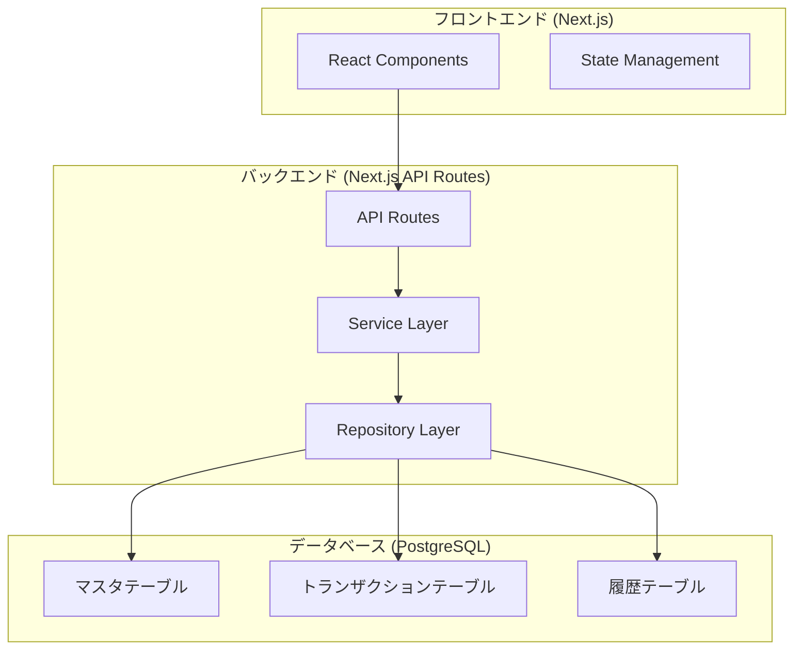
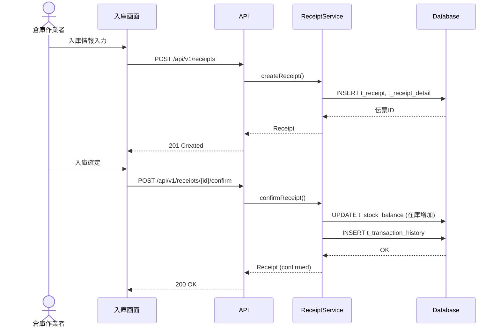
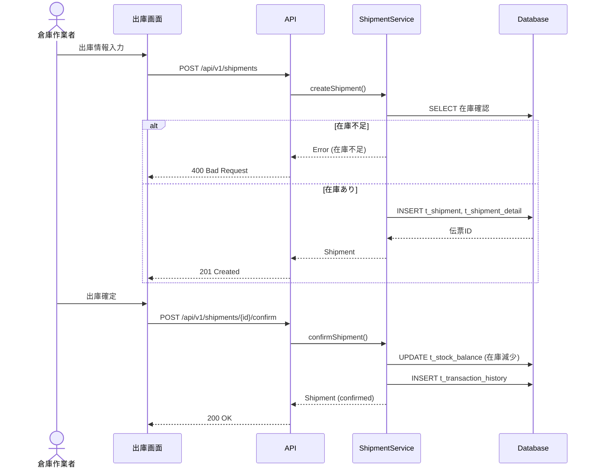
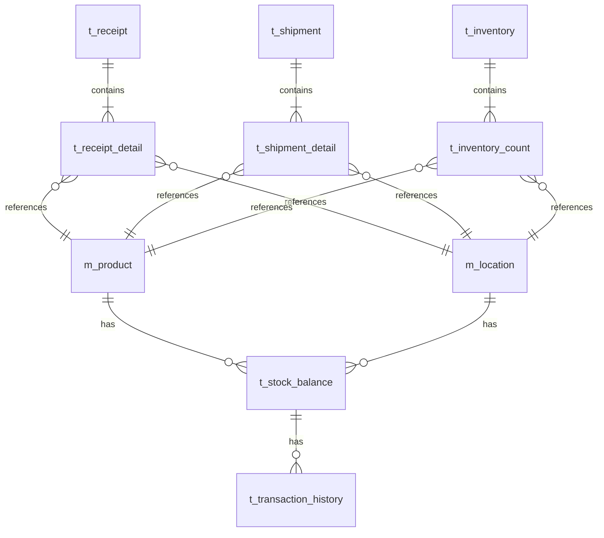

# 設計ドキュメント - 在庫管理システム

---
**目的**: 実装者が異なる場合でも一貫した実装を保証するために、十分な詳細を提供し、解釈のズレを防ぐ。
---

## 概要

**目的**: 本システムは倉庫管理者・倉庫作業者に対し、在庫の入出庫管理、在庫残照会、棚卸し機能を提供する。
**ユーザー**: 倉庫管理者が在庫状況の把握と棚卸しを行い、倉庫作業者が日常の入出庫作業を記録する。
**影響**: 新規システムとして構築。既存システムとの統合は想定しない（MVP）。

**成果物（推奨）**:
> - `.cursor/cursor-sdd-demo/artifacts/feature-list.md`
> - `.cursor/cursor-sdd-demo/artifacts/data-model.md`
> - `.cursor/cursor-sdd-demo/artifacts/table-definition.md`

### ゴール
- 在庫の入出庫をリアルタイムに記録し、正確な在庫数量を維持する
- SKU × ロケーション単位での在庫照会を可能にする
- 棚卸しによる帳簿在庫と実在庫の差異是正を実現する
- 入出庫履歴によるトレーサビリティを確保する

### 非ゴール
- 発注管理・購買管理（将来検討）
- 複数倉庫間の在庫移動（Phase2以降）
- バーコード/QRコードスキャン連携（将来検討）
- 外部システム（ERP/WMS）との連携（将来検討）

## アーキテクチャ

### アーキテクチャパターン＆境界マップ

**アーキテクチャ統合**:
- 選択パターン: モノリシック（Next.js フルスタック）- MVPとして開発速度を優先
- ドメイン/機能境界: マスタ管理、入庫、出庫、在庫照会、棚卸しで責任を分離
- 新コンポーネントの理由: 各ドメインごとにService/Repositoryを分離し保守性を確保

### 技術スタック

| レイヤー | 選択 / バージョン | 機能での役割 | 備考 |
|---------|-----------------|-------------|------|
| フロントエンド | Next.js 16.0.10 / React 19.2.1 | UI/UX提供 | App Router使用 |
| スタイリング | Tailwind CSS 4.x / shadcn/ui | UIコンポーネント | |
| バックエンド | Next.js API Routes | REST API提供 | |
| ORM | Prisma | DB操作 | 追加予定 |
| データベース | PostgreSQL 15 | データ永続化 | |
| リンター | Biome 2.2.0 | コード品質 | |
| 認証 | NextAuth.js | ユーザー認証 | Phase2で実装 |

## システムフロー

### 入庫フロー

### 出庫フロー

## 要件トレーサビリティ

| 要件 | 概要 | コンポーネント | インターフェース | フロー |
|------|------|--------------|----------------|--------|
| 1.1-1.4 | 在庫マスタ管理 | ProductService, LocationService | API-003~007 | - |
| 2.1-2.4 | 入庫管理 | ReceiptService | API-008, API-009 | 入庫フロー |
| 3.1-3.4 | 出庫管理 | ShipmentService | API-010, API-011 | 出庫フロー |
| 4.1-4.4 | 在庫照会 | StockService | API-001, API-002 | - |
| 5.1-5.4 | 棚卸し管理 | InventoryService | API-013~015 | - |
| 6.1-6.3 | 入出庫履歴 | TransactionService | API-012 | - |

## コンポーネントとインターフェース

| コンポーネント | ドメイン/レイヤー | 意図 | 要件カバレッジ | 主要な依存関係 | 契約 |
|--------------|-----------------|------|--------------|--------------|------|
| ProductService | マスタ管理 | 商品マスタCRUD | 1.1, 1.2 | Repository (P0) | Service, API |
| LocationService | マスタ管理 | ロケーションマスタCRUD | 1.3 | Repository (P0) | Service, API |
| StockService | 在庫照会 | 在庫残照会・CSV出力 | 4.1-4.4 | Repository (P0) | Service, API |
| ReceiptService | 入庫 | 入庫伝票作成・確定 | 2.1-2.4 | StockBalanceRepo (P0) | Service, API |
| ShipmentService | 出庫 | 出庫伝票作成・確定 | 3.1-3.4 | StockBalanceRepo (P0) | Service, API |
| InventoryService | 棚卸し | 棚卸し管理 | 5.1-5.4 | StockBalanceRepo (P0) | Service, API |
| TransactionService | 履歴 | 入出庫履歴照会 | 6.1-6.3 | Repository (P0) | Service, API |

### マスタ管理ドメイン

#### ProductService

| フィールド | 詳細 |
|----------|------|
| 意図 | 商品（SKU）マスタの登録・更新・取得 |
| 要件 | 1.1, 1.2 |

**責任と制約**
- 商品のCRUD操作
- SKUコードの一意性保証
- 商品更新時の変更履歴記録

**契約**: Service [x] / API [x]

##### API契約

| メソッド | エンドポイント | リクエスト | レスポンス | エラー |
|---------|--------------|-----------|----------|--------|
| GET | /api/v1/products | ?search, ?page, ?limit | Product[] | 400 |
| POST | /api/v1/products | CreateProductRequest | Product | 400, 409 |
| PUT | /api/v1/products/{id} | UpdateProductRequest | Product | 400, 404, 409 |

### 入庫ドメイン

#### ReceiptService

| フィールド | 詳細 |
|----------|------|
| 意図 | 入庫伝票の作成・確定、在庫増加処理 |
| 要件 | 2.1, 2.2, 2.3, 2.4 |

**責任と制約**
- 入庫伝票の作成・確定
- 確定時に在庫残（t_stock_balance）を増加
- 取引履歴（t_transaction_history）の記録
- 数量バリデーション（0以下はエラー）

**契約**: Service [x] / API [x]

##### API契約

| メソッド | エンドポイント | リクエスト | レスポンス | エラー |
|---------|--------------|-----------|----------|--------|
| POST | /api/v1/receipts | CreateReceiptRequest | Receipt | 400 |
| POST | /api/v1/receipts/{id}/confirm | - | Receipt | 400, 404 |

### 出庫ドメイン

#### ShipmentService

| フィールド | 詳細 |
|----------|------|
| 意図 | 出庫伝票の作成・確定、在庫減少処理 |
| 要件 | 3.1, 3.2, 3.3, 3.4 |

**責任と制約**
- 出庫伝票の作成・確定
- 確定時に在庫残（t_stock_balance）を減少
- 在庫不足チェック（不足時はエラー）
- 取引履歴（t_transaction_history）の記録

**契約**: Service [x] / API [x]

##### API契約

| メソッド | エンドポイント | リクエスト | レスポンス | エラー |
|---------|--------------|-----------|----------|--------|
| POST | /api/v1/shipments | CreateShipmentRequest | Shipment | 400 |
| POST | /api/v1/shipments/{id}/confirm | - | Shipment | 400, 404, 422 |

## データモデル

> 詳細は `.cursor/cursor-sdd-demo/artifacts/data-model.md` および `table-definition.md` を参照。

### ドメインモデル

**集約とトランザクション境界**:
- 商品（Product）: 独立した集約
- ロケーション（Location）: 独立した集約
- 在庫残（StockBalance）: Product × Location の組み合わせで一意
- 入庫伝票（Receipt）: 伝票ヘッダ + 明細の集約
- 出庫伝票（Shipment）: 伝票ヘッダ + 明細の集約
- 棚卸し（Inventory）: 棚卸しヘッダ + カウント明細の集約

**ビジネスルール**:
- 在庫残は Product × Location で一意
- 出庫時は在庫残 >= 出庫数量 を検証
- 入出庫確定後は取引履歴に記録（追記のみ）

### 論理データモデル

## エラーハンドリング

### エラーカテゴリとレスポンス

**ユーザーエラー (4xx)**:
- 400 Bad Request: 入力値バリデーションエラー（数量が0以下、必須項目未入力）
- 404 Not Found: 指定されたリソースが存在しない
- 409 Conflict: SKUコード重複

**ビジネスロジックエラー (422)**:
- 在庫不足: 出庫数量 > 在庫残の場合
- 伝票ステータス不正: 確定済み伝票の再確定

**システムエラー (5xx)**:
- 500 Internal Server Error: DB接続エラー等

## テスト戦略

### ユニットテスト
- ProductService: 商品登録、SKU重複チェック
- ReceiptService: 入庫確定、在庫増加ロジック
- ShipmentService: 出庫確定、在庫不足チェック
- StockService: 在庫照会、検索フィルタリング

### 統合テスト
- 入庫 → 在庫増加 → 在庫照会の一連フロー
- 出庫 → 在庫減少 → 在庫不足エラーのフロー
- 棚卸し → 差異反映 → 在庫調整のフロー

### E2Eテスト
- 入庫登録画面からの入庫確定
- 出庫登録画面からの出庫確定（在庫不足エラー含む）
- 在庫一覧画面での検索・CSV出力

---

## 変更履歴

| 日付 | バージョン | 変更者 | 変更内容 |
| ---- | ---------- | ------ | -------- |
| 2025-12-14 | v1.0 | | 初版作成 |
