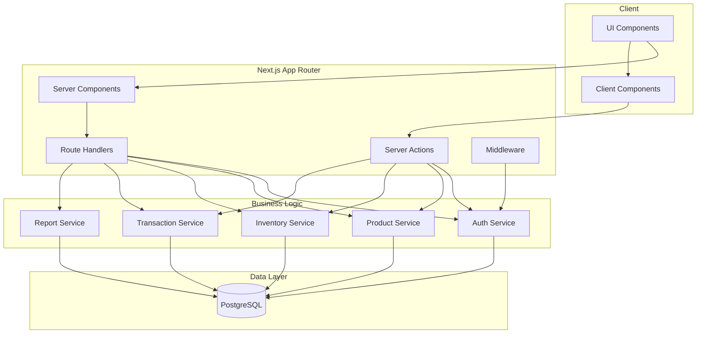
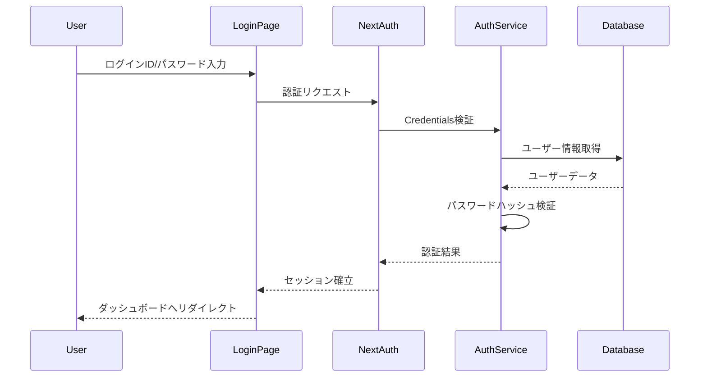
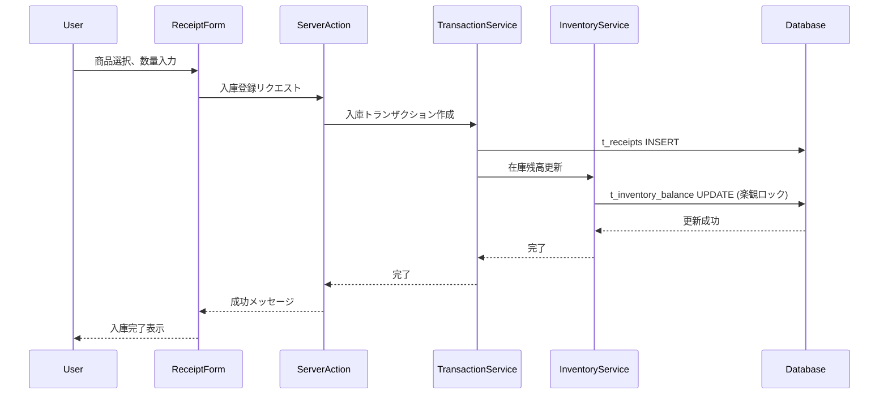
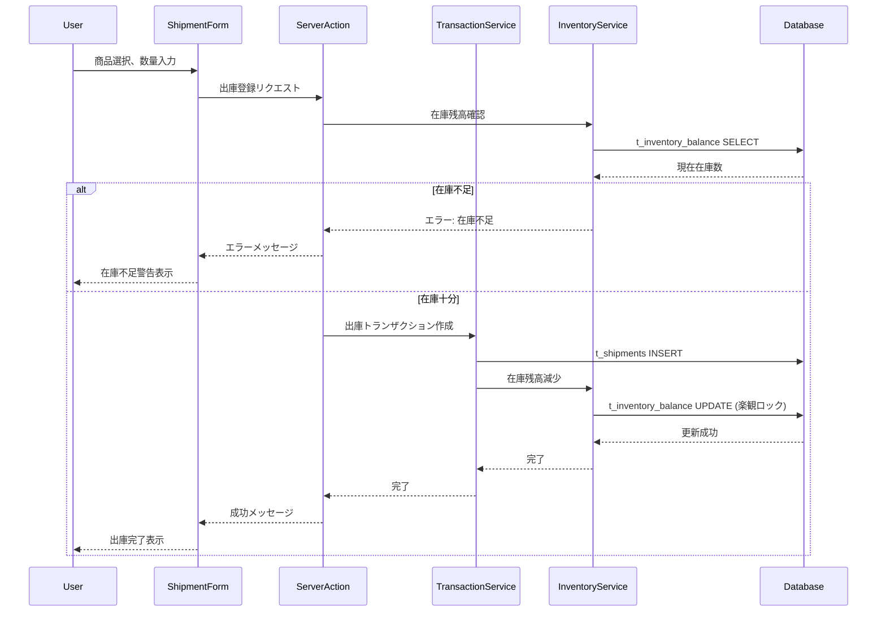

# 技術設計ドキュメント

---
**目的**: 実装者が異なる場合でも一貫した実装を保証するために、十分な詳細を提供し、解釈のズレを防ぐ。

**アプローチ**:
- 実装の判断に直接影響する必須セクションを含める
- 実装エラーの防止に重要でない限り、オプションセクションは省略
- 機能の複雑さに応じた詳細レベル
- 長い文章よりも図表やテーブルを使用
---

## 概要

**目的**: 在庫管理システムは、在庫管理者とシステム管理者に対して、商品の入出庫管理、在庫残高の可視化、在庫移動の追跡機能を提供する。これにより、効率的な在庫運用と正確な在庫把握を実現する。

**ユーザー**: 在庫管理者が日常的な入出庫登録、在庫照会、レポート確認を行う。システム管理者がユーザー管理とアクセス制御を実施する。

**影響**: 新規システムの構築。既存システムはなく、ゼロからの実装となる。

**成果物（推奨）**: 設計の一次ソースとして、以下3つを作成済み。設計と矛盾させない。
> - `.cursor/cursor-sdd-demo/artifacts/feature-list.md`
> - `.cursor/cursor-sdd-demo/artifacts/data-model.md`
> - `.cursor/cursor-sdd-demo/artifacts/table-definition.md`

### ゴール
- 商品マスタの登録・編集・削除機能を提供
- 入庫・出庫・在庫移動のトランザクション記録
- 商品ごと・ロケーションごとの在庫残高をリアルタイムで可視化
- ユーザー認証とロールベースのアクセス制御
- ダッシュボードとレポート機能による在庫状況の把握
- すべての操作の監査ログ記録

### 非ゴール
- 外部システムとの連携（ERPやWMSとの統合は将来フェーズ）
- バーコード・RFIDスキャナーとの連携（Phase2以降）
- 複数拠点間のリアルタイム同期（単一データベースで管理）
- モバイルアプリ（Webアプリのみ）
- 高度な在庫予測・需要予測機能

## アーキテクチャ

> 詳細な調査ノートは`research.md`を参照（背景情報のみ）。レビュアーのために設計ドキュメントを自己完結型に保ち、すべての決定事項と契約をここに記載する。

### 既存アーキテクチャ分析
該当なし（新規プロジェクト）

### アーキテクチャパターン＆境界マップ

**アーキテクチャ統合**:
- **選択パターン**: レイヤードアーキテクチャ（プレゼンテーション層、ビジネスロジック層、データアクセス層）
  - 理由: Next.js App Routerの構造に適合し、MVPに適したシンプルな構造
- **ドメイン/機能境界**: 
  - 認証・認可（Auth）
  - 商品管理（Products）
  - 在庫管理（Inventory）
  - トランザクション管理（Transactions: Receipts, Shipments, Transfers）
  - レポート・ダッシュボード（Reports）
- **新コンポーネントの理由**: 
  - Server Components: サーバーサイドレンダリングでパフォーマンス向上
  - Route Handlers: APIエンドポイントの実装
  - Server Actions: フォーム送信とデータ変更の処理
- **ステアリング準拠**: 型安全性（TypeScript）、Server Components優先、エラーハンドリング



### 技術スタック

| レイヤー | 選択 / バージョン | 機能での役割 | 備考 |
|---------|-----------------|-------------|------|
| フロントエンド | Next.js 16.0.10 | App Router、Server Components、Route Handlers | React 19.2.1と統合 |
| フロントエンド | React 19.2.1 | UIコンポーネント、Server Components | Server Components優先 |
| フロントエンド | TypeScript 5.x | 型安全性 | anyを使用しない |
| フロントエンド | Tailwind CSS 4.x | スタイリング | ユーティリティファースト |
| 認証 | NextAuth.js 5.x | 認証・セッション管理 | Credentials Provider使用 |
| データベース | PostgreSQL 15+ | データ永続化 | トランザクション整合性 |
| リンター | Biome 2.2.0 | コード品質 | フォーマットとリント |

> 既存のpackage.jsonから実際のバージョンを記載。Next.js 16とReact 19の組み合わせでServer Componentsを最大限活用。

## システムフロー

### 認証フロー



### 入庫フロー



### 出庫フロー（在庫不足チェック含む）



## 要件トレーサビリティ

| 要件 | 概要 | コンポーネント | インターフェース | フロー |
|------|------|--------------|----------------|--------|
| 1.1-1.7 | 商品マスタ管理 | ProductService, ProductListPage, ProductFormPage | /api/products | CRUD操作 |
| 2.1-2.6 | 入庫管理 | TransactionService, ReceiptFormPage, ReceiptListPage | /api/receipts | 入庫フロー |
| 3.1-3.6 | 出庫管理 | TransactionService, ShipmentFormPage, ShipmentListPage | /api/shipments | 出庫フロー |
| 4.1-4.6 | 在庫照会 | InventoryService, InventoryListPage | /api/inventory | 在庫取得 |
| 5.1-5.6 | 在庫移動管理 | TransactionService, TransferFormPage, TransferListPage | /api/transfers | 在庫移動フロー |
| 6.1-6.6 | ユーザー認証とアクセス制御 | AuthService, LoginPage, Middleware | /api/auth | 認証フロー |
| 7.1-7.6 | レポートとダッシュボード | ReportService, DashboardPage | /api/dashboard, /api/reports | レポート生成 |

## コンポーネントとインターフェース

### コンポーネント概要

| コンポーネント | ドメイン/レイヤー | 意図 | 要件カバレッジ | 主要な依存関係 (P0/P1) | 契約 |
|-|-|-|-|-|-|
| AuthService | ビジネスロジック/認証 | ユーザー認証とセッション管理 | 6.1-6.6 | NextAuth (P0), PostgreSQL (P0) | Service, API |
| ProductService | ビジネスロジック/商品 | 商品マスタのCRUD操作 | 1.1-1.7 | PostgreSQL (P0) | Service, API |
| InventoryService | ビジネスロジック/在庫 | 在庫残高の管理と照会 | 4.1-4.6 | PostgreSQL (P0) | Service, API |
| TransactionService | ビジネスロジック/トランザクション | 入出庫・移動のトランザクション処理 | 2.1-2.6, 3.1-3.6, 5.1-5.6 | InventoryService (P0), PostgreSQL (P0) | Service, API |
| ReportService | ビジネスロジック/レポート | ダッシュボードとレポート生成 | 7.1-7.6 | PostgreSQL (P0) | Service, API |
| LoginPage | UI/認証 | ログイン画面 | 6.1-6.3 | AuthService (P0) | - |
| DashboardPage | UI/ダッシュボード | ダッシュボード画面 | 7.1-7.2 | ReportService (P0) | - |
| ProductListPage | UI/商品 | 商品一覧画面 | 1.7 | ProductService (P0) | - |
| ProductFormPage | UI/商品 | 商品登録/編集画面 | 1.1-1.6 | ProductService (P0) | - |
| InventoryListPage | UI/在庫 | 在庫一覧画面 | 4.1-4.6 | InventoryService (P0) | - |
| ReceiptFormPage | UI/入庫 | 入庫登録画面 | 2.1-2.5 | TransactionService (P0) | - |
| ReceiptListPage | UI/入庫 | 入庫履歴一覧画面 | 2.6 | TransactionService (P0) | - |
| ShipmentFormPage | UI/出庫 | 出庫登録画面 | 3.1-3.5 | TransactionService (P0) | - |
| ShipmentListPage | UI/出庫 | 出庫履歴一覧画面 | 3.6 | TransactionService (P0) | - |
| TransferFormPage | UI/在庫移動 | 在庫移動登録画面 | 5.1-5.5 | TransactionService (P0) | - |
| TransferListPage | UI/在庫移動 | 在庫移動履歴一覧画面 | 5.6 | TransactionService (P0) | - |
| Middleware | インフラ/認証 | ルート保護とアクセス制御 | 6.5 | AuthService (P0) | - |

### ビジネスロジック層

#### AuthService

| フィールド | 詳細 |
|----------|------|
| 意図 | ユーザー認証、セッション管理、アクセス制御 |
| 要件 | 6.1, 6.2, 6.3, 6.4, 6.5, 6.6 |

**責任と制約**
- ユーザー認証（ログイン/ログアウト）
- セッション管理（作成、検証、破棄）
- パスワードハッシュ化（bcrypt）
- ロールベースアクセス制御（RBAC）
- 操作ログ記録

**依存関係**
- インバウンド: LoginPage, Middleware, Route Handlers — 認証リクエスト (P0)
- アウトバウンド: PostgreSQL — ユーザーデータとセッション永続化 (P0)
- 外部: NextAuth.js — 認証フレームワーク (P0), bcrypt — パスワードハッシュ化 (P0)

**契約**: Service [x] / API [x]

##### サービスインターフェース

```typescript
interface AuthService {
  /**
   * ユーザー認証
   */
  authenticate(credentials: { loginId: string; password: string }): Promise<Result<User, AuthError>>;
  
  /**
   * セッション検証
   */
  validateSession(token: string): Promise<Result<Session, AuthError>>;
  
  /**
   * ログアウト
   */
  logout(token: string): Promise<Result<void, AuthError>>;
  
  /**
   * アクセス権限チェック
   */
  checkPermission(userId: bigint, resource: string, action: string): Promise<boolean>;
}

type User = {
  id: bigint;
  loginId: string;
  displayName: string;
  role: 'admin' | 'operator' | 'viewer';
  isActive: boolean;
};

type Session = {
  id: bigint;
  userId: bigint;
  token: string;
  expiresAt: Date;
};

type AuthError = 
  | { type: 'INVALID_CREDENTIALS' }
  | { type: 'SESSION_EXPIRED' }
  | { type: 'PERMISSION_DENIED' };
```

- 事前条件: ユーザーが登録済み、パスワードがハッシュ化されている
- 事後条件: 認証成功時にセッションが作成される
- 不変条件: パスワードは平文で保存しない

##### API契約

| メソッド | エンドポイント | リクエスト | レスポンス | エラー |
|---------|--------------|-----------|----------|--------|
| POST | /api/auth/login | { loginId: string, password: string } | { user: User, token: string } | 401, 500 |
| POST | /api/auth/logout | { token: string } | { success: boolean } | 401, 500 |
| GET | /api/auth/session | - | { user: User, session: Session } | 401, 500 |

**実装ノート**
- 統合: NextAuth.jsのCredentials Providerを使用
- 検証: パスワードはbcryptでハッシュ化（ソルトラウンド10）
- リスク: ブルートフォース攻撃対策としてレート制限を実装（将来フェーズ）

---

#### ProductService

| フィールド | 詳細 |
|----------|------|
| 意図 | 商品マスタのCRUD操作 |
| 要件 | 1.1, 1.2, 1.3, 1.4, 1.5, 1.6, 1.7 |

**責任と制約**
- 商品の登録、編集、削除（論理削除）
- 商品一覧の取得（検索・絞り込み）
- 商品コードの重複チェック
- 楽観的ロックによる競合制御

**依存関係**
- インバウンド: ProductListPage, ProductFormPage, Route Handlers — 商品操作 (P0)
- アウトバウンド: PostgreSQL — 商品データ永続化 (P0)

**契約**: Service [x] / API [x]

##### サービスインターフェース

```typescript
interface ProductService {
  /**
   * 商品一覧取得
   */
  list(filter: ProductFilter): Promise<Result<Product[], ServiceError>>;
  
  /**
   * 商品詳細取得
   */
  getById(id: bigint): Promise<Result<Product, ServiceError>>;
  
  /**
   * 商品登録
   */
  create(data: CreateProductInput): Promise<Result<Product, ServiceError>>;
  
  /**
   * 商品更新
   */
  update(id: bigint, data: UpdateProductInput, lockNo: bigint): Promise<Result<Product, ServiceError>>;
  
  /**
   * 商品削除（論理削除）
   */
  delete(id: bigint, lockNo: bigint): Promise<Result<void, ServiceError>>;
}

type Product = {
  id: bigint;
  productCode: string;
  name: string;
  categoryId: bigint;
  unit: string;
  unitPrice: number | null;
  isActive: boolean;
  createdAt: Date;
  updatedAt: Date;
  lockNo: bigint;
};

type ProductFilter = {
  search?: string;
  categoryId?: bigint;
  isActive?: boolean;
};

type CreateProductInput = {
  productCode: string;
  name: string;
  categoryId: bigint;
  unit: string;
  unitPrice?: number;
};

type UpdateProductInput = Partial<CreateProductInput>;
```

##### API契約

| メソッド | エンドポイント | リクエスト | レスポンス | エラー |
|---------|--------------|-----------|----------|--------|
| GET | /api/products | { search?, categoryId?, isActive? } | { products: Product[] } | 400, 500 |
| GET | /api/products/:id | - | { product: Product } | 404, 500 |
| POST | /api/products | CreateProductInput | { product: Product } | 400, 409, 500 |
| PUT | /api/products/:id | UpdateProductInput & { lockNo } | { product: Product } | 400, 404, 409, 500 |
| DELETE | /api/products/:id | { lockNo } | { success: boolean } | 404, 409, 500 |

**実装ノート**
- 統合: PostgreSQLのm_productsテーブルに対するCRUD操作
- 検証: 商品コードの重複チェック、必須項目の検証
- リスク: 楽観的ロック競合時のリトライ処理が必要

---

#### InventoryService

| フィールド | 詳細 |
|----------|------|
| 意図 | 在庫残高の管理と照会 |
| 要件 | 4.1, 4.2, 4.3, 4.4, 4.5, 4.6 |

**責任と制約**
- 商品ごと・ロケーションごとの在庫残高取得
- 在庫残高の更新（入出庫・移動時）
- 在庫不足チェック
- 楽観的ロックによる競合制御

**依存関係**
- インバウンド: InventoryListPage, TransactionService, Route Handlers — 在庫操作 (P0)
- アウトバウンド: PostgreSQL — 在庫データ永続化 (P0)

**契約**: Service [x] / API [x]

##### サービスインターフェース

```typescript
interface InventoryService {
  /**
   * 在庫一覧取得
   */
  list(filter: InventoryFilter): Promise<Result<InventoryBalance[], ServiceError>>;
  
  /**
   * 商品別在庫取得
   */
  getByProduct(productId: bigint): Promise<Result<InventoryBalance[], ServiceError>>;
  
  /**
   * 在庫残高更新（入庫）
   */
  increaseStock(productId: bigint, locationId: bigint, quantity: number): Promise<Result<void, ServiceError>>;
  
  /**
   * 在庫残高更新（出庫）
   */
  decreaseStock(productId: bigint, locationId: bigint, quantity: number): Promise<Result<void, ServiceError>>;
  
  /**
   * 在庫不足チェック
   */
  checkStock(productId: bigint, locationId: bigint, quantity: number): Promise<boolean>;
  
  /**
   * CSV出力
   */
  exportCsv(filter: InventoryFilter): Promise<Result<string, ServiceError>>;
}

type InventoryBalance = {
  id: bigint;
  productId: bigint;
  locationId: bigint;
  quantity: number;
  updatedAt: Date;
  lockNo: bigint;
  product?: Product;
  location?: Location;
};

type InventoryFilter = {
  search?: string;
  productId?: bigint;
  locationId?: bigint;
  sortBy?: 'quantity' | 'productName';
  sortOrder?: 'asc' | 'desc';
};
```

##### API契約

| メソッド | エンドポイント | リクエスト | レスポンス | エラー |
|---------|--------------|-----------|----------|--------|
| GET | /api/inventory | { search?, productId?, locationId?, sortBy?, sortOrder? } | { inventory: InventoryBalance[] } | 400, 500 |
| GET | /api/inventory/:productId/history | - | { history: Transaction[] } | 404, 500 |
| GET | /api/inventory/export | { filter } | CSV file | 400, 500 |

**実装ノート**
- 統合: PostgreSQLのt_inventory_balanceテーブルに対する操作
- 検証: 在庫不足チェック、楽観的ロック競合検出
- リスク: 高頻度更新時の競合、定期的な在庫集計バッチで整合性確保

---

#### TransactionService

| フィールド | 詳細 |
|----------|------|
| 意図 | 入出庫・移動のトランザクション処理 |
| 要件 | 2.1-2.6, 3.1-3.6, 5.1-5.6 |

**責任と制約**
- 入庫トランザクションの作成と在庫残高の増加
- 出庫トランザクションの作成と在庫残高の減少
- 在庫移動トランザクションの作成と在庫残高の移動
- トランザクション整合性の保証

**依存関係**
- インバウンド: ReceiptFormPage, ShipmentFormPage, TransferFormPage, Route Handlers — トランザクション操作 (P0)
- アウトバウンド: InventoryService — 在庫残高更新 (P0), PostgreSQL — トランザクションデータ永続化 (P0)

**契約**: Service [x] / API [x]

##### サービスインターフェース

```typescript
interface TransactionService {
  /**
   * 入庫登録
   */
  createReceipt(data: CreateReceiptInput): Promise<Result<Receipt, ServiceError>>;
  
  /**
   * 入庫履歴取得
   */
  listReceipts(filter: TransactionFilter): Promise<Result<Receipt[], ServiceError>>;
  
  /**
   * 出庫登録
   */
  createShipment(data: CreateShipmentInput): Promise<Result<Shipment, ServiceError>>;
  
  /**
   * 出庫履歴取得
   */
  listShipments(filter: TransactionFilter): Promise<Result<Shipment[], ServiceError>>;
  
  /**
   * 在庫移動登録
   */
  createTransfer(data: CreateTransferInput): Promise<Result<Transfer, ServiceError>>;
  
  /**
   * 在庫移動履歴取得
   */
  listTransfers(filter: TransactionFilter): Promise<Result<Transfer[], ServiceError>>;
}

type Receipt = {
  id: bigint;
  productId: bigint;
  userId: bigint;
  quantity: number;
  receiptDate: Date;
  remarks: string | null;
  createdAt: Date;
};

type Shipment = {
  id: bigint;
  productId: bigint;
  userId: bigint;
  quantity: number;
  shipmentDate: Date;
  destination: string | null;
  remarks: string | null;
  createdAt: Date;
};

type Transfer = {
  id: bigint;
  productId: bigint;
  fromLocationId: bigint;
  toLocationId: bigint;
  userId: bigint;
  quantity: number;
  transferDate: Date;
  remarks: string | null;
  createdAt: Date;
};

type CreateReceiptInput = {
  productId: bigint;
  userId: bigint;
  quantity: number;
  receiptDate: Date;
  remarks?: string;
};

type CreateShipmentInput = {
  productId: bigint;
  userId: bigint;
  quantity: number;
  shipmentDate: Date;
  destination?: string;
  remarks?: string;
};

type CreateTransferInput = {
  productId: bigint;
  fromLocationId: bigint;
  toLocationId: bigint;
  userId: bigint;
  quantity: number;
  transferDate: Date;
  remarks?: string;
};

type TransactionFilter = {
  productId?: bigint;
  startDate?: Date;
  endDate?: Date;
};
```

##### API契約

| メソッド | エンドポイント | リクエスト | レスポンス | エラー |
|---------|--------------|-----------|----------|--------|
| POST | /api/receipts | CreateReceiptInput | { receipt: Receipt } | 400, 500 |
| GET | /api/receipts | { productId?, startDate?, endDate? } | { receipts: Receipt[] } | 400, 500 |
| POST | /api/shipments | CreateShipmentInput | { shipment: Shipment } | 400, 422, 500 |
| GET | /api/shipments | { productId?, startDate?, endDate? } | { shipments: Shipment[] } | 400, 500 |
| POST | /api/transfers | CreateTransferInput | { transfer: Transfer } | 400, 422, 500 |
| GET | /api/transfers | { productId?, startDate?, endDate? } | { transfers: Transfer[] } | 400, 500 |

**実装ノート**
- 統合: PostgreSQLのトランザクションを使用して、トランザクションテーブルと在庫残高テーブルを同時に更新
- 検証: 在庫不足チェック（出庫・移動時）、数量の正の整数チェック
- リスク: トランザクション失敗時のロールバック、楽観的ロック競合時のリトライ

---

#### ReportService

| フィールド | 詳細 |
|----------|------|
| 意図 | ダッシュボードとレポート生成 |
| 要件 | 7.1, 7.2, 7.3, 7.4, 7.5, 7.6 |

**責任と制約**
- ダッシュボード情報の集計（総在庫数、在庫金額、在庫切れ商品数）
- カテゴリ別在庫数の集計
- 期間指定レポートの生成
- 在庫回転率の計算
- 在庫アラートの検出

**依存関係**
- インバウンド: DashboardPage, Route Handlers — レポート要求 (P0)
- アウトバウンド: PostgreSQL — データ集計 (P0)

**契約**: Service [x] / API [x]

##### サービスインターフェース

```typescript
interface ReportService {
  /**
   * ダッシュボード情報取得
   */
  getDashboard(): Promise<Result<DashboardData, ServiceError>>;
  
  /**
   * 期間レポート生成
   */
  generateReport(startDate: Date, endDate: Date): Promise<Result<Report, ServiceError>>;
  
  /**
   * 在庫回転率計算
   */
  calculateTurnoverRate(productId: bigint, period: number): Promise<Result<number, ServiceError>>;
  
  /**
   * 在庫アラート取得
   */
  getAlerts(): Promise<Result<Alert[], ServiceError>>;
}

type DashboardData = {
  totalInventory: number;
  totalValue: number;
  outOfStockCount: number;
  categoryBreakdown: { categoryName: string; quantity: number }[];
  alerts: Alert[];
};

type Report = {
  startDate: Date;
  endDate: Date;
  receipts: { productName: string; quantity: number }[];
  shipments: { productName: string; quantity: number }[];
  transfers: { productName: string; quantity: number }[];
};

type Alert = {
  type: 'OUT_OF_STOCK' | 'LOW_STOCK' | 'EXCESS_STOCK';
  productId: bigint;
  productName: string;
  currentQuantity: number;
  threshold?: number;
};
```

##### API契約

| メソッド | エンドポイント | リクエスト | レスポンス | エラー |
|---------|--------------|-----------|----------|--------|
| GET | /api/dashboard | - | { dashboard: DashboardData } | 500 |
| POST | /api/reports | { startDate, endDate } | { report: Report } | 400, 500 |

**実装ノート**
- 統合: PostgreSQLの集計クエリを使用
- 検証: 日付範囲の妥当性チェック
- リスク: 大量データの集計パフォーマンス、将来的にマテリアライズドビューを検討

---

### プレゼンテーション層

UIコンポーネントは基本的にServer Componentsとして実装し、フォーム送信やインタラクティブな要素のみClient Componentsを使用。

**共通Props定義**:

```typescript
type BasePageProps = {
  searchParams?: { [key: string]: string | string[] | undefined };
};

type BaseFormProps = {
  initialData?: any;
  onSubmit: (data: any) => Promise<void>;
  onCancel?: () => void;
};
```

各UIコンポーネントは上記のベースPropsを拡張し、必要に応じて追加のPropsを定義。詳細な実装はコンポーネントごとに決定。

---

### インフラ層

#### Middleware

| フィールド | 詳細 |
|----------|------|
| 意図 | ルート保護とアクセス制御 |
| 要件 | 6.5 |

**責任と制約**
- 未認証ユーザーのリダイレクト
- ロールベースのアクセス制御
- セッション検証

**依存関係**
- インバウンド: すべてのルート — ルート保護 (P0)
- アウトバウンド: AuthService — セッション検証 (P0)

**実装ノート**
- Next.jsのMiddleware機能を使用
- `/api/auth/*`以外のすべてのルートで認証チェック
- ログインページ以外の未認証アクセスは`/login`へリダイレクト
- ロール別のアクセス制御（admin: 全機能、operator: 読み書き、viewer: 読み取りのみ）

## データモデル

**注記**: データモデルは `data-model.md` / `table-definition.md` と整合している。設計内では決定事項と契約を要約し、詳細は成果物側を一次ソースとして参照。

### ドメインモデル

**集約とトランザクション境界**:
- **ユーザー集約**: ユーザー情報とセッション
- **商品集約**: 商品情報とカテゴリ
- **在庫集約**: 在庫残高とロケーション
- **トランザクション集約**: 入庫、出庫、移動の各トランザクション

**エンティティと値オブジェクト**:
- エンティティ: User, Product, Category, Location, InventoryBalance
- 値オブジェクト: ProductCode, LocationCode, Quantity

**ビジネスルール & 不変条件**:
- 商品コードは一意
- 在庫数は0以上
- 出庫数は在庫残高以下
- トランザクションは追記のみ（更新・削除不可）
- 楽観的ロックで競合制御

### 論理データモデル

**構造定義**:
- マスタテーブル: m_users, m_categories, m_products, m_locations
- トランザクションテーブル: t_sessions, t_receipts, t_shipments, t_transfers, t_inventory_balance, t_audit_logs

**エンティティ関係とカーディナリティ**:
- User 1 : N Session
- Category 1 : N Product
- Product 1 : N InventoryBalance
- Location 1 : N InventoryBalance
- Product 1 : N Receipt/Shipment/Transfer
- User 1 : N Receipt/Shipment/Transfer

**参照整合性ルール**:
- セッションはユーザー削除時にCASCADE削除
- 履歴テーブルはRESTRICTで保護
- 在庫残高は商品/ロケーション削除時にCASCADE削除

詳細は`data-model.md`と`table-definition.md`を参照。

### 物理データモデル

**PostgreSQL テーブル定義**:
- すべてのマスタテーブルに`lock_no`カラムを配置（楽観的ロック）
- トランザクションテーブルは追記のみ（UPDATE/DELETE不可）
- インデックス戦略: 検索頻度の高いカラムに複合インデックス
- 外部キー制約: 参照整合性を保証

詳細は`table-definition.md`を参照。

## エラーハンドリング

### エラー戦略

**型安全なエラーハンドリング**:

```typescript
type Result<T, E> = 
  | { success: true; data: T }
  | { success: false; error: E };

type ServiceError = 
  | { type: 'NOT_FOUND'; message: string }
  | { type: 'VALIDATION_ERROR'; fields: { [key: string]: string } }
  | { type: 'CONFLICT'; message: string }
  | { type: 'PERMISSION_DENIED'; message: string }
  | { type: 'INTERNAL_ERROR'; message: string };
```

### エラーカテゴリとレスポンス

**ユーザーエラー (4xx)**:
- 400 Bad Request: 無効な入力 → フィールドレベル検証エラーを表示
- 401 Unauthorized: 未認証 → ログインページへリダイレクト
- 403 Forbidden: 権限不足 → アクセス拒否メッセージを表示
- 404 Not Found: リソース未検出 → 該当データなしメッセージを表示
- 409 Conflict: 楽観的ロック競合 → リトライまたは最新データの再取得を促す
- 422 Unprocessable Entity: ビジネスルール違反（在庫不足など） → 具体的なエラーメッセージを表示

**システムエラー (5xx)**:
- 500 Internal Server Error: サーバー内部エラー → 一般的なエラーメッセージとサポート連絡先を表示
- タイムアウト → リトライを促す

### モニタリング

- すべての操作を`t_audit_logs`に記録
- エラー発生時はログレベルERRORで記録
- Next.jsのエラーバウンダリ（error.tsx）でグローバルエラーをキャッチ
- 将来的にSentryなどのエラートラッキングツールを導入検討

## テスト戦略

### ユニットテスト
- AuthService: 認証ロジック、パスワードハッシュ検証、セッション管理
- ProductService: 商品CRUD操作、重複チェック
- InventoryService: 在庫残高更新、在庫不足チェック
- TransactionService: トランザクション作成、在庫残高連動
- ReportService: 集計ロジック、在庫回転率計算

### 統合テスト
- 入庫フロー: 入庫登録 → 在庫残高増加
- 出庫フロー: 出庫登録 → 在庫残高減少 → 在庫不足チェック
- 在庫移動フロー: 移動登録 → 移動元減少 → 移動先増加
- 認証フロー: ログイン → セッション確立 → ルート保護
- 楽観的ロック: 同時更新時の競合検出

### E2E/UIテスト
- ログイン → ダッシュボード表示
- 商品登録 → 商品一覧表示
- 入庫登録 → 在庫照会で確認
- 出庫登録（在庫不足） → エラーメッセージ表示
- レポート生成 → CSV出力

## オプションセクション

### セキュリティ考慮事項

**認証・認可**:
- NextAuth.jsによるセッションベース認証
- パスワードはbcryptでハッシュ化（ソルトラウンド10）
- ロールベースアクセス制御（admin, operator, viewer）
- ミドルウェアでルート保護

**データ保護**:
- すべての操作ログを記録（t_audit_logs）
- トランザクションデータは追記のみ（改ざん防止）
- 論理削除でデータ保持

**将来の改善**:
- レート制限（ブルートフォース攻撃対策）
- CSRF保護（Next.jsのServer Actionsで自動対応）
- XSS対策（Reactの自動エスケープ）

### パフォーマンス & スケーラビリティ

**目標メトリクス**:
- ページロード時間: 2秒以内
- API応答時間: 500ms以内
- 同時ユーザー数: 100ユーザー（MVP）

**最適化戦略**:
- Server Componentsでサーバーサイドレンダリング
- PostgreSQLのインデックス最適化
- 将来的にマテリアライズドビューでレポート高速化
- Next.jsのキャッシング戦略（`"use cache"`ディレクティブ）

**スケーリングアプローチ**:
- 垂直スケーリング（サーバースペック向上）
- 将来的に水平スケーリング（ロードバランサー + 複数インスタンス）

---

## 変更履歴

| 日付 | バージョン | 変更者 | 変更内容 |
| ---- | ---------- | ------ | -------- |
| 2025-12-15 | v1.0 |  | 初版作成 |
